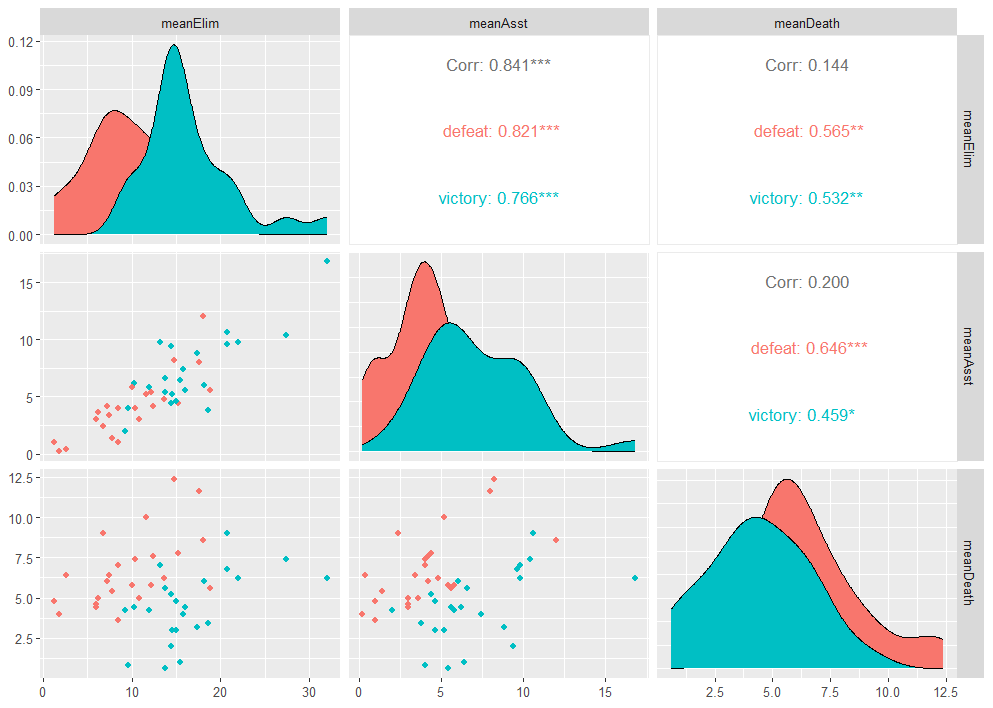
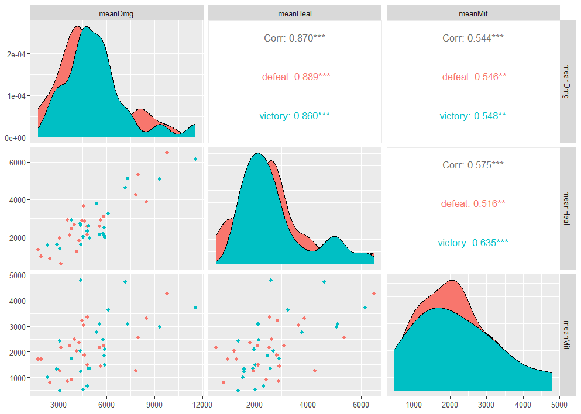
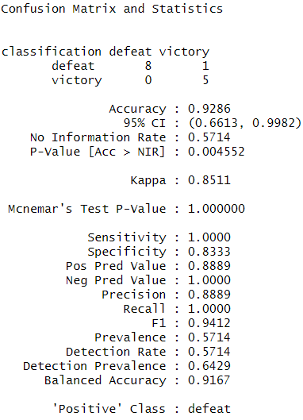
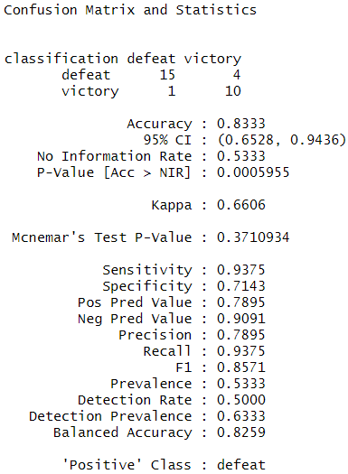

# owl-trainer


---

## Case Study: Overwatch Mystery Heroes Exploratory Data Analysis in R

## Table of Contents
- [Executive Summary](#executive-summary)
- [Introduction](#introduction)
- [Installation and Setup](#installation-and-setup)
- [Codebook](#codebook)
- [Data Collection Method](#data-collection-method)
- [Usage](#usage)
- [Results and Discussion](#results-and-discussion)
- [Contributing](#contributing)
- [License](#license)
- [Contact](#contact)

## Executive Summary

- **Objectives**: Observational study measuring uncertainty to develop a probability model for simple random sampling and determine testing for a difference in sampling distributions.
- **Key Findings**:
- **Conclusions**:

## Introduction
- **Background**:

  Overwatch 2 (2022) is a fast-paced, competitive, team-based, player versus player first-person shooter (FPS) game developed by Blizzard Entertainment. To be a proficient player demands patience, practice, and emotional control. It requires quick thinking, teamwork, communication, and coordination to ascend the rank of Grand Master. Overwatch categorizes heroes into three main, commonly known classes: Damage, Tank and Support; teams must rely on their heroes' special strengths and abilities and work together to secure objectives each round. Players are awarded on a point-based system, allowing them to track and compare in-game performance with others. Players can also view their post-game scores on a scoreboard located in the match history. 
  
  Mystery Heroes is one of many unranked game modes in Overwatch that is played over several unique maps each having different scoring objectives. However, in Mystery Heroes, instead of chosing a hero class, players are randomly assigned heroes at the start each the round and subsequently after each death/respawn. In essence, this restricted game mode prevents players from selecting their favorite or "main" characters and classes. This creates an interesting, dynamic situation for a case study on the game's interplay mechanics, while studying the various distributional anomalies to find hidden, meaningful statistical observations, particularily, what it can tell us about Overwatch itself, the limitless combinations of team and individual play styles, skill levels, hero mastery, and much, much more. 
  
- **Purpose**: 
  1. Classify and predict hero class.
  2. Classify and predict event outcome.
  3. Classify and predict player score.
- **Research Questions**: List the research questions or hypotheses you are exploring.
  1. What is the relationship between skill level/rank and score?
  2. What is the relationship between result and score?
  3. What is the relationship between game_length and score?
- **Hypothesis Testing**: Perform hypothesis testing.
  1. $H_{0}$: Grand Master Elimination/Death Ratio = $\mu$; $H_{A}$: Grand Master Elimination/Death Ratio > $\mu$.
  2. $H_{0}$: Grand Master Damage/Heal/Mitigation = $\mu$; $H_{A}$: Grand Master Damage/Heal/Mitigation > $\mu$.

## Installation and Setup

Detailed instructions on how to set up the project. Include:
- Requirements (e.g., R version, additional software).
- Instructions to install R and RStudio, if necessary.
- Steps to clone the repository and set up the environment.
- Any required R packages and how to install them.

```bash
# Example commands to set up the environment

```

## Codebook

Detail the structure and explanation of the data:

|Variable |Description  |Type |Format/Units |
|---------|-------------|-----|-------------|
|control_no|group match id|integer|1-inf+|
|map_name |map name|character| |
|comp |competitive mode|factor|yes/no|
|result |match result|factor|victory/defeat|
|final_score  |match point|integer|A-B|
|game_mode  | game mode |factor|push/control/hybrid|
|game_length  |match duration|datetime|mm:ss|
|team | 5 vs 5| factor| A or B|
|elimination  | # eliminations | integer | 0-inf+  |
|assist | # assists| integer | 0-inf+ |
|death | # deaths | integer | 0-inf+ |
|damage | total damage| integer | 0-inf+ |
|heal | total heal| integer | 0-inf+ |
|mitigation | total mitigation | integer | 0-inf+ |

- **Session Info**:
```plaintext
R version 4.3.2 (2023-10-31 ucrt)
Platform: x86_64-w64-mingw32/x64 (64-bit)
Running under: Windows 11 x64 (build 22631)
```
- **Variables**: Description of each variable in the data set.
- **Formats or scales used**: Specify units of measurement, categorizations, or scales used.
  - **Data Types**:
    - **game_mode**: hybrid, payload, control
      - **final_score**: Attacker-Defender
    - **game_mode**: push
      - **final_score**: Maximum 1 point
- **Data Source**: Mention the original source of the data.

- **Packages**:
- **Libraries**:

## Data Collection Method

- **Data Source**: Explain where and how you collected the data.
  - **Data Storage**: Local SSD
  - **Data Format**: *.png
  - **Data Size**: 4.18 GB
- **Data Collection Process**: Describe the steps or methodology used in data collection.
  - **Collection Method 1**: Post game match scoreboard 
  - **Collection Method 2**: In-game menu career history 
- **Data Processing**: Outline any processing or cleaning done on the data.
  - **Pre-processing**: Filter incomplete/missing/NA player scores and match point results

## Usage

Instructions on how to run the analysis:
- Steps to load the data into R Studio.
- How to run analysis scripts.
- Any necessary instructions for interpreting the results.

```r
# Example code snippet
```

## Results and Discussion

- **Findings**: Summarize the key findings of the analysis.
- **Visualizations**: Include plots or graphs with appropriate captions.

<p>Correlation plot of match sampling distribution of the sample means elimination, assist, death by control_no, team with respect to result, n = 26</p>

  
  
<p>Correlation plot of match sampling distribution of the sample means damage, heal, mitigation by control_no, team with respect to result, n = 26</p>
  
  

<p>70/30 train test split using KNN to classify and predict match results, n = 14</p>

  

<p> Leave One Out Cross Validation to test the training model for accuracy, n = 30</p>

  

- **Interpretation**: Discuss the implications or significance of the findings.

## Contributing

Guidelines for how others can contribute to your project. This might include:
- Instructions for submitting issues or questions.
- How to propose enhancements or fixes.

## License

This project is currently unlicensed. All rights reserved. Please feel free to contact for permissions to use, modify, or distribute the code in this repository until a license is designated.

## Contact

Provide contact information for further inquiries or collaboration.

- Email: [ddxbugs@proton.me](mailto:ddxbugs@proton.me)
